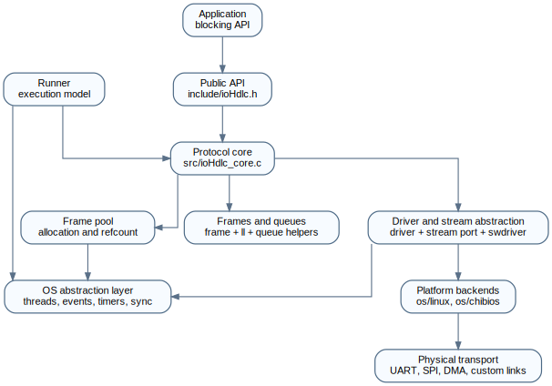
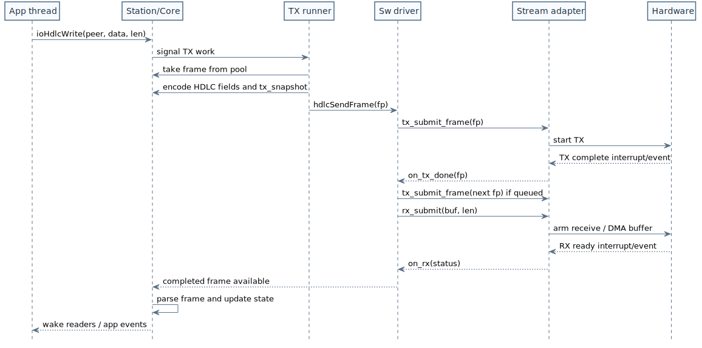
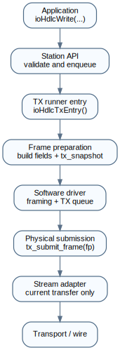
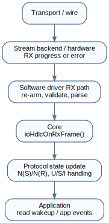
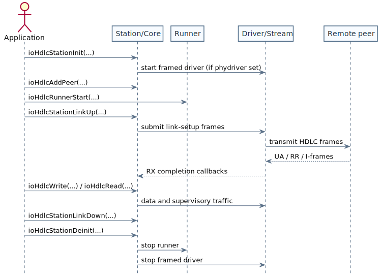

# Architecture

## Overview

ioHdlc is designed as a **portable, OS-agnostic HDLC protocol stack** that can run on multiple platforms through an abstraction layer (OSAL). The architecture separates protocol logic from OS-specific implementations, enabling the same core code to run on ChibiOS, Linux (test platform), and other RTOS environments.

The current implementation is centered on the station/peer model, the shared runner, the software framed driver layered on top of a byte-stream backend, and the connection-management and data-transfer paths for the two supported balanced/unbalanced operational modes: NRM (Normal Response Mode) and ABM (Asynchronous Balanced Mode). Stations are initialized in the corresponding disconnected modes (NDM/ADM) and enter NRM/ABM during link establishment.

## High-Level Architecture



## Core Components

### 1. HDLC Core

**Source:** `src/ioHdlc_core.c`

**Responsibilities:**
- Protocol state machine for the currently implemented connection-management and data-transfer paths
- Frame sequencing (N(S), N(R) management)
- Window control and flow control
- Error recovery (REJ, checkpoint retransmission)
- Timer management integration

**Key Functions:**
- `ioHdlcTxEntry()` - TX worker entry point used by the runner
- `ioHdlcRxEntry()` - RX worker entry point used by the runner
- `ioHdlcNrmTx()` / `ioHdlcAbmTx()` - mode-specific TX schedulers
- `ioHdlcNrmRx()` / `ioHdlcAbmRx()` - mode-specific RX handlers

**Design:**
- OS-agnostic: uses only OSAL primitives
- Event-driven: responds to RX frames, timeouts, user writes
- Thread-safe: uses mutexes for peer state protection

### 2. Station Management

**Source:** `include/ioHdlc.h`, `include/ioHdlctypes.h`

**Note:** `ioHdlc.h` is the umbrella public header and contains the concrete station and peer structure definitions. `include/ioHdlctypes.h` provides only forward declarations and shared scalar types.

**Concept:**
A **station** represents one end of the HDLC link. It can be:
- **Primary** (initiates connections, sends commands)
- **Secondary** (responds to commands)

**Station contains:**
- Configuration and derived runtime state (address, flags, timeouts, active mode)
- List of peers
- Frame pool
- Driver instance
- Internal event source (`cm_es`) for protocol event synchronisation between threads
- Application event source (`app_es`) for notifying upper layers

### 3. Peer Management

**Concept:**
A **peer** represents a remote station that this station communicates with.

**Peer contains:**
- Remote address
- Connection state (disconnected, connecting, connected)
- TX/RX sequence numbers (V(S), V(R), N(R))
- Send window management
- Retry counters
- Timer state

**Multi-peer support:**
One station can communicate with multiple peers (multi-point configuration).

### 4. Frame Pool

**Source:** `include/ioHdlcframepool.h`

**Purpose:**
Pre-allocated frame buffers to avoid dynamic memory allocation in real-time paths.

**Features:**
- **Reference counting**: frames can be shared
- **Watermark monitoring**: LOW/NORMAL thresholds
- **Thread-safe**: lock-free or mutex-protected operations
- **Platform-specific**: implemented in `os/<platform>/src/ioHdlcfmempool.c`

**Operations:**
```c
iohdlc_frame_t *frame = hdlcTakeFrame(pool);  // Allocate
hdlcAddRef(pool, frame);                       // Increment refcount
hdlcReleaseFrame(pool, frame);                 // Decrement, free if 0
```

### 5. Stream Driver and Stream Port Boundary

**Source:** `include/ioHdlcswdriver.h`, `include/ioHdlcstreamport.h`

**Purpose:**
Separate common software HDLC framing/deframing from the byte-stream backend
used to move data on a transport such as UART, SPI, or a mock adapter.

`ioHdlcSwDriver` is the common software framer/deframer. It owns FCS handling,
transparency, Frame Format Field handling, RX frame assembly, and the only
logical TX queue. A stream adapter owns only the transport-specific execution of
the current physical submission.

**Note:** The structs below are simplified for illustration; see `include/ioHdlcstreamport.h` for the authoritative definitions.

**Architecture:**
```c
typedef struct ioHdlcStreamDriverOps {
  int32_t (*build_tx_plan)(void *cb_ctx,
                           const iohdlc_frame_t *fp,
                           const iohdlc_tx_plan_opts_t *opts,
                           iohdlc_tx_plan_t *plan);
} ioHdlcStreamDriverOps;

typedef struct ioHdlcStreamPortOps {
  const iohdlc_stream_caps_t *(*get_caps)(void *ctx);
  void (*start)(void *ctx,
                const ioHdlcStreamCallbacks *cbs,
                const ioHdlcStreamDriverOps *drvops);
  void (*stop)(void *ctx);
  int32_t (*tx_submit_frame)(void *ctx, iohdlc_frame_t *fp);
  bool (*tx_busy)(void *ctx);
  bool (*rx_submit)(void *ctx, uint8_t *ptr, size_t len);
  void (*rx_cancel)(void *ctx);
} ioHdlcStreamPortOps;

typedef struct ioHdlcStreamCallbacks {
  ioHdlcStreamOnRx      on_rx;
  ioHdlcStreamOnTxDone  on_tx_done;
  ioHdlcStreamOnRxError on_rx_error;
  void                 *cb_ctx;
} ioHdlcStreamCallbacks;
```

**`ioHdlcStreamPortOps` operations:**

| Operation | Direction | Description |
|---|---|---|
| `get_caps` | Driver/Core → Backend | Return transport constraints and execution assists |
| `start` | Driver → Backend | Bind the driver callback bundle and optional driver services; begin transport activity |
| `stop` | Driver → Backend | Shutdown the transport; release backend-owned resources |
| `tx_submit_frame` | Driver → Backend | Submit the current frame selected by the driver; returns `0` or an errno-compatible status |
| `tx_busy` | Driver → Backend | Query whether a TX transfer is currently in progress |
| `rx_submit` | Driver → Backend | Arm a receive transfer of `len` bytes into `ptr` |
| `rx_cancel` | Driver → Backend | Cancel the currently armed RX transfer |

`tx_submit_frame()` receives the `iohdlc_frame_t` selected by the software
driver. The frame contains the per-send `tx_snapshot` prepared by the core and,
for contiguous adapters, a driver-materialized wire image. UART, SPI, and the
mock adapter currently consume that contiguous image directly. More capable
adapters may use `ioHdlcStreamDriverOps::build_tx_plan()` to obtain a
scatter/gather description or FCS-offload metadata for the same frame.

**Driver services exposed to adapters:**

| Operation | Direction | Description |
|---|---|---|
| `build_tx_plan` | Backend → Driver | Build a non-transparent TX plan for the supplied frame, using the frame snapshot and adapter-selected options |

**Port capabilities:**

`ioHdlcStreamPortOps::get_caps()` returns an `iohdlc_stream_caps_t` descriptor
containing hard transport constraints and execution assists:

| Flag | Value | Meaning |
|---|---|---|
| `IOHDLC_PORT_CONSTR_TWA_ONLY` | `1 << 0` | Link is half-duplex; `IOHDLC_FLG_TWA` must be set in the station config |
| `IOHDLC_PORT_CONSTR_NRM_ONLY` | `1 << 1` | Transport does not support ABM; `ioHdlcStationLinkUp` returns `ENOTSUP` if ABM is requested |

`ioHdlcStationInit()` reads the constraints from `config->phydriver` and
validates them against the supplied station configuration. The value is stored
in `station->port_constraints` for later checks at link-up time. A constraints
value of zero means no transport-level restrictions.

The assist mask currently describes TX-side execution properties:

| Flag | Meaning |
|---|---|
| `IOHDLC_PORT_AST_TX_NEEDS_CONTIG` | Backend requires one contiguous TX buffer |
| `IOHDLC_PORT_AST_TX_SCATTER_GATHER` | Backend can transmit a driver-generated segment list directly |
| `IOHDLC_PORT_AST_TX_SEAMLESS_CHAIN` | Backend can arm the next TX without a visible wire gap |
| `IOHDLC_PORT_AST_TX_DONE_IN_ISR` | TX completion callback runs in ISR context |

TX FCS offload is described separately by `iohdlc_stream_caps_t::tx_fcs_offload_sizes`.
This list declares which FCS sizes the backend can emit on TX when the driver
keeps the FCS deferred in the transmit plan. It is an execution optimization,
not part of the public driver capability contract.

The public FCS capability remains unified at driver level:
- `driver->caps.fcs.supported_sizes` means end-to-end FCS support for both TX and RX.
- Software fallback, backend-side checking, and TX offload are internal mechanisms used to implement that support.

**Responsibilities:**
- `ioHdlcSwDriver` implements the framed HDLC driver on top of a stream port.
- `ioHdlcSwDriver` owns the logical TX queue and the ordering policy.
- `ioHdlcStreamPortOps` are provided by the backend and called by the driver.
- `ioHdlcStreamCallbacks` are registered by the driver and invoked by the backend.
- The stream adapter executes the current physical submission only.
- HDLC framing, FCS handling, transparency, receive assembly, and frame ownership remain in the driver/core layers.

**Flow direction:**
1. Station initialization reads port capabilities through `get_caps()`.
2. The software driver starts the backend and passes callbacks plus driver services.
3. The core prepares per-send mutable fields in `fp->tx_snapshot`.
4. The software driver serializes or queues the frame, then calls `tx_submit_frame()`.
5. The backend starts the physical transfer and reports completion through `on_tx_done`.
6. On TX completion, the driver may immediately submit the next queued frame from its own TX queue.
7. RX callbacks feed the software deframer, which completes frame-oriented interactions for the core.

The callback-oriented interaction is captured in the following sequence diagram.



### 6. OS Abstraction Layer (OSAL)

**Purpose:**
Provide uniform OS primitives across platforms.

**Abstracted Primitives:**
- **Threads**: `iohdlc_thread_t`, thread creation/join
- **Mutexes**: `iohdlc_mutex_t`, lock/unlock
- **Semaphores**: `iohdlc_sem_t`, wait/signal
- **Binary Semaphores**: `iohdlc_binary_semaphore_t`
- **Events**: `iohdlc_event_source_t`, broadcast/wait
- **Timers**: `iohdlc_virtual_timer_t`, start/stop/expired

**Implementations:**
- `os/linux/`: POSIX threads, pthread mutexes, condition variables
- `os/chibios/`: ChibiOS threads, mutexes, semaphores, virtual timers

### 7. Runner

**Source:** `src/ioHdlc_runner.c`

**Purpose:**
Provide the common execution shell around the station core.

**Responsibilities:**
- Create TX/RX threads
- Map OS timers to core timer interface
- Map OS events to core event system
- Call core entry points (`ioHdlcTxEntry`, `ioHdlcRxEntry`)

**Design:**
- The runner logic is shared and lives in the common source tree.
- Thread creation, timers, events, and synchronization are delegated to OSAL.
- Platform-specific behaviour lives below the runner, in OSAL and backend implementations.

#### 7.1 Runner → Core: execution entry points

The current shared runner enters the core through the worker entry points declared in `include/ioHdlc_core.h`:

| Function | Description |
|---|---|
| `ioHdlcTxEntry(station)` | TX worker loop: waits for core events and drives connection-management/data transmission |
| `ioHdlcRxEntry(station)` | RX worker loop: pulls frames from the driver, detects idle conditions, and dispatches received frames |

`ioHdlcOnRxFrame()` and `ioHdlcOnLineIdle()` are still declared in the boundary header, but the current runner implementation handles receive dispatch and line-idle detection directly inside `ioHdlcRxEntry()`.

#### 7.2 Core → Runner: concrete link-time functions

The core is OS-agnostic but calls concrete functions defined in `src/ioHdlc_runner.c`, resolved at link time. These functions bridge the core's protocol logic to the runner's OSAL-based timer and event infrastructure without runtime indirection.

**Timer management (per peer):**

| Function | Description |
|---|---|
| `ioHdlcStartReplyTimer(peer, kind, ms)` | Arm a reply timer for the given peer and timer kind |
| `ioHdlcRestartReplyTimer(peer, kind, ms)` | Restart a reply timer only if it is currently armed |
| `ioHdlcStopReplyTimer(peer, kind)` | Disarm the timer and clear its expired flag |
| `ioHdlcIsReplyTimerExpired(peer, kind)` | Return `true` if the timer fired and was not explicitly stopped |

**Event management (macros defined in `include/ioHdlc_core.h`):**

| Macro / Function | Description |
|---|---|
| `ioHdlcBroadcastFlags(station, flags)` | Broadcast internal core event flags to the station's `cm_es` |
| `ioHdlcBroadcastFlagsApp(station, flags)` | Broadcast application-facing event flags to `app_es` |
| `ioHdlcWaitEvents(station)` | Block until any core event flag is set; return and clear the pending mask |

## Data Flow

### TX Path (Application → Wire)

Application calls `ioHdlcWriteTmo()` → data is enqueued and
`IOHDLC_EVT_TX_IFRM_ENQ` is broadcast → the TX thread wakes and builds an
I-frame → the core stores the per-send mutable fields in `fp->tx_snapshot` →
the software driver serializes the frame or places it in its driver-owned TX
queue → the stream adapter receives `tx_submit_frame(fp)` for the current
physical submission → the backend transmits the bytes over the physical
transport and reports completion with `on_tx_done`.



### RX Path (Wire → Application)

The stream port receives bytes → the software driver assembles a frame and validates wire-level integrity → `ioHdlcRxEntry()` pulls the completed frame through `hdlcRecvFrame()` → the mode-specific RX handler processes the control fields, enqueues accepted I-frames into the peer reception queue, and signals the peer receive semaphore → the application's `ioHdlcReadTmo()` call wakes and returns the data. `IOHDLC_EVT_I_RECVD` is also broadcast internally so the TX/core side can react to acknowledgements and receive-side state changes.



## Integration Lifecycle

The lifecycle below focuses on the normal integration path from init to
shutdown.

**Note:** `ioHdlcStationInit()` automatically starts the driver when `config->phydriver` is set, so the transport adapter must be fully initialized before calling init.
`ioHdlcStationInit()` does **not** start the runner threads; `ioHdlcRunnerStart()` remains a separate step, and `ioHdlcStationDeinit()` is the symmetric force-stop teardown entry point for runner plus driver.



## Threading Model

### Two-Thread Architecture

**TX Thread:**
- Waits for events (data to send, timer expiry)
- Builds and transmits frames
- Manages retransmissions

**RX Thread/Callback:**
- Processes received frames
- Updates state machine
- Signals TX thread as needed

**Why Two Threads?**
- **Decoupling**: TX and RX operate independently
- **Responsiveness**: RX can process frames immediately
- **Simplicity**: Clear separation of concerns

### Event-Driven Synchronization

```c
// Application writes data
ioHdlcWriteTmo(peer, data, len, tmo)
    └─> Broadcast IOHDLC_EVT_TX_IFRM_ENQ
            └─> TX thread wakes up
                    └─> Transmits frame

// Timer expires
Timer callback()
    └─> Broadcast IOHDLC_EVT_C_RPLYTMO
            └─> TX thread wakes up
                    └─> Handles timeout (retransmit)

// Frame received
rx_callback()
    └─> driver completes a frame
            └─> RX thread pulls it with hdlcRecvFrame()
                    └─> Core enqueues I-frame and signals peer->i_recept_sem
                            └─> ioHdlcReadTmo() returns data
```

## Memory Management

All memory is pre-allocated at init time — no `malloc`/`free` occurs in the critical path. Frame buffers are fixed-size and drawn from the pool described in section 4. Reference counting (`hdlcTakeFrame`, `hdlcAddRef`, `hdlcReleaseFrame`) allows a single frame to be shared across the TX queue, the retransmit buffer, and the application layer without copying. Memory usage is bounded by the arena size provided at init.

The frame lifecycle below summarizes the ownership handoff between pool,
protocol queues, driver usage, and final recycle.


## Portability Strategy

### Abstraction Layers

1. **OSAL** (`os/<platform>/`)
   - Platform-specific implementations
   - Same API across platforms

2. **Stream backends / adapters**
    - Map a transport implementation to `ioHdlcStreamPort`
    - Define callback context, DMA constraints, execution assists, and buffer ownership at the transport boundary
    - Execute the current physical TX/RX operation without owning protocol ordering

3. **Frame pool backend** (`os/<platform>/src/ioHdlcfmempool.c`)
    - Platform-specific allocation and synchronization details
    - Same pool/refcount/watermark semantics across platforms

4. **Common runner and core** (`src/`)
    - Shared execution model and protocol logic
    - Platform-independent as long as OSAL and the selected backend honour the contracts

### Core Portability

The core and runner (`src/ioHdlc*.c`, `include/ioHdlc*.h`) are designed to stay OS-agnostic:
- No `#ifdef` for platform selection
- Only uses OSAL types and macros
- Same integration model across supported platforms

## Configuration

### Runtime Configuration Model

```c
iohdlc_station_config_t config = {
  .mode = IOHDLC_OM_NDM,
  .flags = IOHDLC_FLG_PRI,
  .log2mod = 3,
  .addr = 0x01,
  .driver = (ioHdlcDriver *)&driver,
  .phydriver = &port,
  .frame_arena = arena,
  .frame_arena_size = sizeof arena,
  .max_info_len = 0,          // auto from driver / FFF constraints
  .pool_watermark = 0,        // auto
  .fff_type = 0,              // auto
  .optfuncs = optfuncs_array,
  .reply_timeout_ms = 1000,
  .poll_retry_max = 0         // default policy
};
```

**Station initialization derives additional runtime state:**

The frame size and pool dimensions are determined based on the constraints imposed by the memory arena and the driver. The control field size and frame offset, on the other hand, depend on the selected modulo and the adopted FFF policy. Fast-access protocol flags are derived from the optional-functions bitmap, while the final driver configuration is established only after validating that FCS, transparency, and FFF compatibility align with the driver’s capabilities.

Build-time policy defaults such as reply timeout, poll-retry limit, pool watermarks, and similar integration parameters are collected in `include/ioHdlc_conf.h`. The public umbrella header `include/ioHdlc.h` includes that file automatically. Integrators override those defaults through compile-time macro definitions; protocol constants and wire-format bit definitions remain outside this configuration header.

`ioHdlcStationInit()` currently accepts only disconnected initial modes (`IOHDLC_OM_NDM` for unbalanced setups, `IOHDLC_OM_ADM` for balanced setups). The operational mode used on the link (`IOHDLC_OM_NRM` or `IOHDLC_OM_ABM`) is selected later by `ioHdlcStationLinkUp()`.

## Extension Points

### Adding New Platforms

1. Implement OSAL (`os/newplatform/include/ioHdlcosal.h`)
2. Implement frame pool (`os/newplatform/src/ioHdlcfmempool.c`)
3. Implement or adapt a stream backend / transport adapter
4. Reuse the common runner and core
5. Create build system (Makefile, CMakeLists.txt)
6. Write platform-specific tests

### Adding New Physical Layers

1. Implement stream driver callbacks:
    - backend ops such as `get_caps()`, `start()`, `tx_submit_frame()`, `rx_submit()`
    - callback notifications such as `on_rx()`, `on_tx_done()`, `on_rx_error()`
2. Integrate with hardware (UART, SPI, USB, etc.)
3. Declare hard transport constraints and TX-side execution assists through `get_caps()`
4. Handle DMA or interrupt-driven I/O
5. Respect the ownership and callback-context contract documented by the backend

## Performance Considerations

The design decisions described above — pre-allocated frame pools, reference-counted zero-copy frame passing, contiguous DMA-friendly buffers, and OSAL-level lock-free or mutex-protected operations — combine to provide bounded latency and predictable memory usage suitable for real-time embedded systems.

## Future Enhancements

- **Selective Reject (SREJ)**: Retransmit only specific frames
- **Link quality monitoring**: Track error rates, adjust timeouts
- **Dynamic window sizing**: Adapt to line conditions

---

## Appendix A: VMT Polymorphism Pattern

ioHdlc uses a C polymorphism pattern. It provides runtime dispatch without C++ overhead, using only plain structs and function pointers.

### A.1 Structure of an interface

Each abstract interface declares three building blocks in its header:

**`_methods` macro** — the vtable layout: one function pointer entry per virtual operation.

**`_data` macro** — data fields shared by all implementations of the interface.

**Base struct** — combines a `vmt` pointer (must be the **first field**) with the `_data` macro fields. Because `vmt` is first, a pointer to any concrete type can be safely cast to the base.

```c
/* From include/ioHdlcdriver.h */

#define _iohdlc_driver_methods                                       \
  void (*start)(void *ip, void *phydrvp, void *phyconfigp,           \
      ioHdlcFramePool *fpp);                                         \
  void (*stop)(void *ip);                                             \
  int32_t (*send_frame)(void *ip, iohdlc_frame_t *fp);               \
  iohdlc_frame_t * (*recv_frame)(void *ip, iohdlc_timeout_t tmo);    \
  const ioHdlcDriverCapabilities* (*get_capabilities)(void *ip);      \
  int32_t (*configure)(void *ip, uint8_t fcs_size,                   \
      bool transparency, uint8_t fff_type);

#define _iohdlc_driver_data  \
  ioHdlcFramePool *fpp;

struct _iohdlc_driver_vmt { _iohdlc_driver_methods };

typedef struct {
  const struct _iohdlc_driver_vmt *vmt;   /* MUST be first field */
  _iohdlc_driver_data
} ioHdlcDriver;
```

### A.2 Concrete implementation

A concrete type embeds the base struct as its **first field**, or expands the
same leading fields when the concrete structure is public and layout-compatible
with the base. It provides a `static const` vtable and assigns it in its init
function:

```c
/* Concrete type — from src/ioHdlcswdriver.c */
typedef struct {
  const struct _iohdlc_driver_vmt *vmt;   /* MUST be first */
  _iohdlc_driver_data
  ioHdlcSwDriverPortState port;
  /* ... other implementation-specific fields ... */
} ioHdlcSwDriver;

/* One vtable per type, shared by all instances */
static const struct _iohdlc_driver_vmt s_vmt = {
  .start            = drv_start,
  .stop             = drv_stop,
  .send_frame       = drv_send_frame,
  .recv_frame       = drv_recv_frame,
  .get_capabilities = drv_get_capabilities,
  .configure        = drv_configure,
};

void ioHdlcSwDriverInit(ioHdlcSwDriver *drv, const ioHdlcSwDriverInitConfig *config) {
  (void)config;
  drv->vmt = &s_vmt;   /* bind vtable */
  /* initialise remaining fields */
}
```

### A.3 Dispatch at call sites

Callers hold a pointer to the base type and dispatch through the vtable, either directly or via a dispatch macro defined alongside the interface:

```c
ioHdlcDriver *drv = station->driver;

/* Direct dispatch */
drv->vmt->send_frame(drv, fp);

/* Via dispatch macro */
hdlcSendFrame(drv, fp);
```

### A.4 Interfaces using this pattern

| Interface | Base type | Concrete implementation | Source |
|---|---|---|---|
| Framed driver | `ioHdlcDriver` | `ioHdlcSwDriver` | `src/ioHdlcswdriver.c` |
| Frame pool | `ioHdlcFramePool` | `ioHdlcFrameMemPool` | `os/<platform>/src/ioHdlcfmempool.c` |

To add a new implementation: embed the base struct as the first field of your concrete struct, fill a `static const` vtable with your function pointers, and assign the vtable in your init. No changes to the core or runner are needed.
