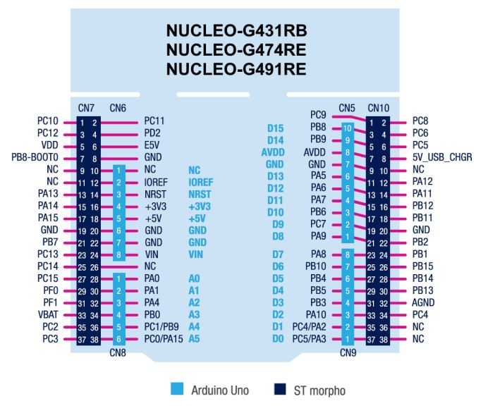

# Getting Started with Hardware

This guide walks through setting up ioHdlc on an STM32 NUCLEO-G474RE board,
from wiring to running a first HDLC exchange over real UART or SPI hardware.

## What You Need

- **STM32 NUCLEO-G474RE** board
- **2-5 female-female jumper wires** (2 for UART, 5 for SPI)
- **USB cable** for ST-Link power, programming, and console
- **Serial terminal**: `screen`, `minicom`, or PuTTY

## Build Environment

### ARM GCC Toolchain

The `arm-none-eabi-gcc` toolchain (10.x or later) must be in your PATH.

**Debian / Ubuntu:**

```bash
sudo apt install gcc-arm-none-eabi
```

Alternatively, download the toolchain from the
[Arm Developer website](https://developer.arm.com/downloads/-/gnu-rm) and
add its `bin/` directory to your PATH.

### ChibiOS/RT Source Tree

The Makefile expects ChibiOS to be located next to the ioHdlc directory:

```
workspace/
├── ChibiOS/       ← ChibiOS/RT source tree
└── ioHdlc/        ← this repository
```

If your ChibiOS checkout is elsewhere, create a symbolic link:

```bash
# From the workspace directory that contains ioHdlc
ln -s /path/to/your/ChibiOS ChibiOS
```

Or override the path on the command line:

```bash
make shell CHIBIOS=/path/to/ChibiOS
```

## Console Output

The test console uses **LPUART1** (`PA2` / `PA3`), routed through the
ST-Link virtual COM port. No external wiring is needed for the console.

The console typically appears as `/dev/ttyACM0` (Linux) or `COMx`
(Windows). Settings: **115200 baud, 8N1**.

```bash
screen /dev/ttyACM0 115200
```

## Board Pinout Reference

The following figure shows the `NUCLEO-G474RE` connector layout with the pins
used by the `stm32g474re` frontend highlighted.



## UART Loopback Wiring

The UART test uses two UART peripherals on the same MCU, cross-connected
for loopback:

- **Endpoint A / Primary**: `USART1`
- **Endpoint B / Secondary**: `USART3`

**2 wires:**


| Wire | From | To |
|------|------|----|
| 1 | `PA9` — `USART1_TX` | `PC11` — `USART3_RX` |
| 2 | `PC10` — `USART3_TX` | `PA10` — `USART1_RX` |

The cross-connection is essential: each transmitter connects to the other
peripheral's receiver.

### Building for UART

```bash
cd tests/chibios/stm32g474re
make clean
make shell USE_UART_ADAPTER=1
```

This builds `build/iohdlc_shell.elf` with the UART hardware adapter at
**2.6 Mbaud** on both endpoints.

Other targets work the same way:

```bash
make tests USE_UART_ADAPTER=1
make exchange USE_UART_ADAPTER=1
```

During a sustained UART stress test, you can also unplug and reconnect one of
the two UART loopback wires to observe the protocol recovery behavior in
practice. If the connection is restored within the protocol recovery window,
the exchange resumes regularly. With the default `exchange` parameters, this
window is about **26.6 s**. This experiment is especially convenient on UART
because the loopback uses only two wires; the SPI setup is more articulated
and is less practical for this kind of manual disruption test.

## SPI Loopback Wiring

The SPI test uses `SPI1` (master, Endpoint A) and `SPI2` (slave, Endpoint B)
on the same MCU, cross-connected for loopback.

This frontend uses:

- hardware `CS/NSS`
- `DATA_READY` (`DR`) for slave-to-master notification

So the default loopback requires **5 wires**:


| Wire | From | To |
|------|------|----|
| 1 | `PB3` — `SPI1_SCK` | `PB13` — `SPI2_SCK` |
| 2 | `PB5` — `SPI1_MOSI` | `PB15` — `SPI2_MOSI` |
| 3 | `PB14` — `SPI2_MISO` | `PB4` — `SPI1_MISO` |
| 4 | `PA4` — `SPI1_NSS` | `PB12` — `SPI2_NSS` |
| 5 | `PB10` — `DR output` | `PA8` — `DR input` |

### Why DATA_READY Is Required

SPI is a master-driven bus: the master generates the clock for every transfer.
Even with DMA, the master has no way to know when the slave has queued a frame
to send unless an out-of-band signal is provided.

The **DATA_READY (`DR`)** line solves this:

- the slave asserts `DR` high when a frame is ready to transmit
- the master monitors `DR` via a GPIO interrupt
- the master starts the receive DMA transfer only when real data is pending

On the `G474RE`, the SPI peripheral's FIFO helps absorb short receive rearm
latencies, but it does not remove the need for `DR`: the master still needs a
deterministic indication that a slave frame is ready.

### Building for SPI

```bash
cd tests/chibios/stm32g474re
make clean
make shell USE_SPI_ADAPTER=1
```

For this frontend, `USE_SPI_ADAPTER=1` already enables `IOHDLC_SPI_USE_DR`.
No extra `CFLAGS_EXTRA` flag is required.

Other targets:

```bash
make tests USE_SPI_ADAPTER=1
make exchange USE_SPI_ADAPTER=1
```

### SPI Operates in TWA Mode

The SPI adapter sets the `ADAPTER_CONSTRAINT_TWA_ONLY` flag. The exchange
tool detects this and selects `TWA` mode automatically. If you explicitly
request `TWS`, the tool prints an error and exits.

## Flashing

### Drag-and-drop

Copy the `.bin` file to the `NUCLEO` USB mass storage device that appears
when the board is connected:

```bash
cp build/iohdlc_shell.bin /media/$USER/NUCLEO/
```

The board resets and runs the firmware automatically.

### Other flashing workflows

If you prefer OpenOCD, GDB, or another debugger-driven workflow, use the
standard STM32G474RE setup already established in your environment. The
generated ELF/BIN artifacts are in `tests/chibios/stm32g474re/build/`.

## Running Your First Test

Connect the serial terminal and you should see the shell prompt:

```
iohdlc>
```

### UART quick test

```
iohdlc> exchange --count=10 --size=64
```

Expected output:

```
========================================
Initializing HDLC stations...
========================================

Using adapter: UART Hardware

========================================
Starting HDLC protocol runners...
========================================

Establishing connection...
✅ Connection established

========================================
Starting data exchange...
========================================

Progress: 100/100 packets sent, 100 rcv | PRI: 100/100 | SEC: 100/100

========================================
TEST COMPLETED
========================================
```

### SPI quick test

```
iohdlc> exchange --count=10 --size=64
```

The output is analogous, but the adapter reports `SPI Hardware`. `TWA` mode
is selected automatically by the adapter constraint.

### Stress test

For a longer run with error statistics:

```
iohdlc> exchange --count=1000 --size=120 --exchanges=50
```

See [Exchange Test Tool](TEST_EXCHANGE.md) for all available options.

## Performance

The current `stm32g474re` hardware frontends are configured as follows:

- **UART**: `2.6 Mbaud` on both endpoints
- **SPI**: `SCK = 170 MHz / 32 = 5.3125 MHz`

On the `NUCLEO-G474RE`, the UART backend has been validated at `2.6 Mbaud`
and reaches about **1.9 Mb/s** of net payload throughput in sustained
`ABM/TWS` traffic.

On the `NUCLEO-G474RE`, the SPI backend has been validated at `5.3125 MHz`
and reaches about **4.6 Mb/s** of net payload throughput in sustained `TWA`
traffic.

These figures refer to **application payload bytes** delivered end-to-end,
not raw wire bitrate. HDLC framing, DMA turnarounds, and `DR` handshakes are
not counted as payload.

Both endpoints run on the **same MCU**, so the measurements include resource
sharing effects that do not exist in a two-device deployment.

## Mock Adapter (No Hardware)

To run protocol tests without any wiring, build with the mock adapter:

```bash
cd tests/chibios/stm32g474re
make clean
make shell
```

The mock adapter uses in-memory loopback and is useful for validating the
firmware build and ChibiOS integration without hardware connections.

## Troubleshooting

**No serial output after flashing:**
- Verify the USB cable is connected to the ST-Link USB connector
- Check the serial port name (`ls /dev/ttyACM*`) and baud rate (`115200`)
- Press the board RESET button

**UART: connection not established**
- Verify the TX-to-RX cross-wiring (`PA9 -> PC11`, `PC10 -> PA10`)
- Check that the jumper wires are firmly seated

**SPI: protocol stalls or no data received**
- Verify all five SPI wires are connected
- Check the `DR` wire: `PB10 -> PA8`
- Check the `CS/NSS` wire: `PA4 -> PB12`
- Build with `USE_SPI_ADAPTER=1`

**SPI: "adapter requires TWA mode" error**
- Do not pass `--tws` when using the SPI adapter
- `TWA` is the only supported mode on this half-duplex SPI transport
