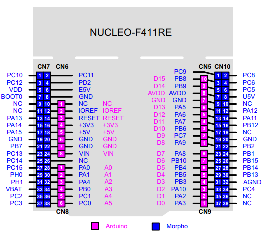
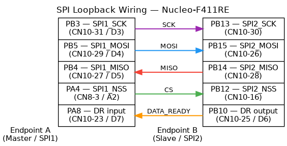

# Getting Started with Hardware

This guide walks through setting up ioHdlc on an STM32 Nucleo-F411RE board,
from wiring to running a first HDLC exchange over real UART or SPI hardware.

## What You Need

- **STM32 Nucleo-F411RE** board (any revision)
- **2-5 female-female jumper wires** (2 for UART, 5 for SPI)
- **USB micro-B cable** (for ST-Link programming and console)
- **Serial terminal**: `screen`, `minicom`, or PuTTY

## Build Environment

### ARM GCC Toolchain

The `arm-none-eabi-gcc` toolchain (10.x or later) must be in your PATH.

**Debian / Ubuntu:**

```bash
sudo apt install gcc-arm-none-eabi
```

Alternatively, download the toolchain from the
[Arm Developer website](https://developer.arm.com/downloads/-/gnu-rm) and
add its `bin/` directory to your PATH.

### ChibiOS/RT Source Tree

The Makefile expects ChibiOS to be located next to the ioHdlc directory:

```
workspace/
├── ChibiOS/       ← ChibiOS/RT source tree
└── ioHdlc/        ← this repository
```

If your ChibiOS checkout is elsewhere, create a symbolic link:

```bash
# From the workspace directory that contains ioHdlc
ln -s /path/to/your/ChibiOS ChibiOS
```

Or override the path on the command line:

```bash
make shell CHIBIOS=/path/to/ChibiOS
```

### OpenOCD (optional)

Needed for flashing via command line. Drag-and-drop flashing via the
Nucleo's USB mass storage device does not require OpenOCD.

```bash
sudo apt install openocd
```

## Console Output

The test console uses **USART2** (PA2/PA3), which is routed through the
ST-Link virtual COM port on the Nucleo board. **No external wiring is needed
for the console** -- just connect the USB cable.

The console appears as `/dev/ttyACM0` (Linux) or `COMx` (Windows).
Settings: **115200 baud, 8N1**.

```bash
screen /dev/ttyACM0 115200
```

## Board Pinout Reference

The following diagram shows the Nucleo-F411RE connector layout. All test pins
are on **CN10** (right-side Morpho connector), except the SPI master CS (PA4)
which is on **CN8**.



## UART Loopback Wiring

The UART test uses two UART peripherals on the same board, cross-connected
to form a loopback: USART1 (Endpoint A, primary) talks to USART6 (Endpoint B,
secondary). Both stations run on the same MCU.

**2 wires, both on the CN10 Morpho connector (right side of the board):**


| Wire | From | To |
|------|------|----|
| 1 | PA9 — USART1_TX (CN10-21 / D8) | PC7 — USART6_RX (CN10-19 / D9) |
| 2 | PC6 — USART6_TX (CN10-4) | PA10 — USART1_RX (CN10-33 / D2) |

The cross-connection (TX-to-RX) is essential: each transmitter connects to the
other peripheral's receiver.

### Building for UART

```bash
cd tests/chibios
make clean
make shell USE_UART_ADAPTER=1
```

This builds `build/iohdlc_shell.elf` with the UART hardware adapter at
1.2 Mbaud on both endpoints.

Other targets work the same way:

```bash
make tests USE_UART_ADAPTER=1       # automated test suite
make exchange USE_UART_ADAPTER=1    # stress test (compile-time config)
```

## SPI Loopback Wiring

The SPI test uses SPI1 (master, Endpoint A) and SPI2 (slave, Endpoint B)
on the same board, cross-connected for loopback.

**5 wires** -- 3 SPI data signals (SCK, MOSI, MISO), 1 chip select (CS),
and 1 DATA_READY (DR):



| Wire | From | To |
|------|------|----|
| 1 | PB3 — SPI1_SCK (CN10-31 / D3) | PB13 — SPI2_SCK (CN10-30) |
| 2 | PB5 — SPI1_MOSI (CN10-29 / D4) | PB15 — SPI2_MOSI (CN10-26) |
| 3 | PB14 — SPI2_MISO (CN10-28) | PB4 — SPI1_MISO (CN10-27 / D5) |
| 4 | PA4 — SPI1_NSS (CN8-3 / A2) | PB12 — SPI2_NSS (CN10-16) |
| 5 | PB10 — DR output (CN10-25 / D6) | PA8 — DR input (CN10-23 / D7) |

All SPI2 pins and the DATA_READY signals are on **CN10**. The master CS pin
(PA4) is on **CN8** (Arduino A2 header); all other wires are on the same
connector.

### Why DATA_READY Is Required

SPI is a master-driven bus: the master generates the clock for every
transfer. This means the master has no way to know when the slave has a
frame ready to send -- regardless of whether the SPI peripheral has a
hardware FIFO or not.

Without an out-of-band signal, the only alternative is continuous receive
polling with single-byte transactions. On the STM32F411's SPI peripheral,
which lacks a hardware FIFO, the per-transaction overhead makes this
approach impractical even at moderate data rates.

The **DATA_READY (DR)** line solves this. The slave asserts DR (active high)
when it has queued a frame for transmission. The master monitors DR via a
GPIO interrupt (PAL event callback) and initiates a DMA receive transfer
only when data is actually available.

Even on MCUs with more capable SPI peripherals, DR remains beneficial: it
eliminates polling overhead entirely and allows the master to use efficient
DMA transfers sized to the actual frame length.

@note The `IOHDLC_SPI_USE_DR` compile flag controls whether DR support is
included in the build.

### Building for SPI

The SPI adapter requires **two build options**:

| Option | Purpose |
|--------|---------|
| `USE_SPI_ADAPTER=1` | Selects `adapter_spi.c` and the SPI stream port backend |
| `CFLAGS_EXTRA="-DIOHDLC_SPI_USE_DR"` | Enables DATA_READY line handling in the SPI stream driver and the test adapter |

Both are needed. Without `IOHDLC_SPI_USE_DR` the code compiles, but the
master cannot detect when the slave has data -- the protocol will stall.

```bash
cd tests/chibios
make clean
make shell USE_SPI_ADAPTER=1 CFLAGS_EXTRA="-DIOHDLC_SPI_USE_DR"
```

Other targets:

```bash
make tests USE_SPI_ADAPTER=1 CFLAGS_EXTRA="-DIOHDLC_SPI_USE_DR"
make exchange USE_SPI_ADAPTER=1 CFLAGS_EXTRA="-DIOHDLC_SPI_USE_DR"
```

### SPI Operates in TWA Mode

The SPI adapter sets the `ADAPTER_CONSTRAINT_TWA_ONLY` flag. The exchange
tool detects this and selects TWA mode automatically -- there is no need
to pass `--twa` explicitly. If you explicitly pass `--tws`, the tool will
print an error and exit.

## Flashing

### Drag-and-drop (simplest)

Copy the `.bin` file to the `NUCLEO` USB mass storage device that appears
when the board is connected:

```bash
cp build/iohdlc_shell.bin /media/$USER/NUCLEO/
```

The board resets and runs the firmware automatically.

### OpenOCD

```bash
openocd -f board/st_nucleo_f4.cfg \
  -c "program build/iohdlc_shell.elf verify reset exit"
```

### GDB

```bash
arm-none-eabi-gdb build/iohdlc_shell.elf
(gdb) target extended-remote :3333
(gdb) load
(gdb) continue
```

## Running Your First Test

Connect the serial terminal and you should see the shell prompt:

```
iohdlc>
```

### UART quick test

```
iohdlc> exchange --count=10 --size=64
```

Expected output:

```
========================================
Initializing HDLC stations...
========================================

Using adapter: UART Hardware (UARTD1 + UARTD6)

========================================
Starting HDLC protocol runners...
========================================

Establishing connection...
✅ Connection established

========================================
Starting data exchange...
========================================

Progress: 100/100 packets sent, 100 rcv | PRI: 100/100 | SEC: 100/100

========================================
TEST COMPLETED
========================================
```

### SPI quick test

```
iohdlc> exchange --count=10 --size=64
```

The output is the same, but the adapter reports `SPI Hardware (SPI1 + SPI2)`.
TWA mode is selected automatically by the adapter constraint.

### Stress test

For a longer run with error statistics:

```
iohdlc> exchange --count=1000 --size=120 --exchanges=50
```

See [Exchange Test Tool](TEST_EXCHANGE.md) for all available options.

## Performance

Even on the Nucleo-F411RE -- a low-cost Cortex-M4 board with basic
peripherals -- ioHdlc achieves substantial net payload throughput:

| Transport | Mode | Net payload throughput |
|-----------|------|------------------------|
| UART (1.2 Mbaud) | Full-duplex (TWS) | >1 Mb/s bidirectional |
| SPI | Half-duplex (TWA) | >1.3 Mb/s unidirectional |

These figures are measured with the `exchange` tool using maximum-size
frames (120 bytes) and sustained traffic, and refer to **application payload bytes** delivered end-to-end, net of
HDLC framing overhead. Both stations run on the **same MCU**, which introduces
shared-bus contention not present in a real deployment; actual throughput
on separate devices is expected to be higher.

The UART rate is limited by the baud rate. The SPI rate is limited by the
DMA round-trip and the F411's basic SPI peripheral, which lacks a hardware
FIFO and other DMA-friendly features found on higher-end STM32 families --
significantly better throughput (×10) is expected on MCUs with more
capable SPI peripherals. Both transports use DMA for zero-copy frame
transfers.

> **Note (SPI):** The >1.3 Mb/s figure requires the DATA_READY signal
> (`IOHDLC_SPI_USE_DR`) and a patch to the ChibiOS low-level SPI driver
> that eliminates the SPI peripheral reset between transfers. Without the
> patch, throughput is lower.

## Mock Adapter (No Hardware)

To run protocol tests without any wiring, build with the mock adapter:

```bash
cd tests/chibios
make clean
make shell
```

The mock adapter uses in-memory loopback -- useful for validating the
firmware build and ChibiOS integration without hardware connections.

## Troubleshooting

**No serial output after flashing:**
- Verify the USB cable is connected to the ST-Link micro-USB port (not the
  Nucleo user USB if present)
- Check the serial port name (`ls /dev/ttyACM*`) and baud rate (115200)
- Press the black RESET button on the board

**"Connection not established" error:**
- Verify the TX-to-RX cross-wiring (most common mistake: TX connected to TX)
- Check that jumper wires are firmly seated in the Morpho headers

**SPI: protocol stalls or no data received:**
- Verify the DATA_READY wire (PB10 → PA8) is connected
- Verify the build includes `CFLAGS_EXTRA="-DIOHDLC_SPI_USE_DR"`
- Check that CS wire (PA4 → PB12) is connected

**SPI: "adapter requires TWA mode" error:**
- Do not pass `--tws` when using the SPI adapter; TWA is the only supported
  mode on half-duplex SPI transports
