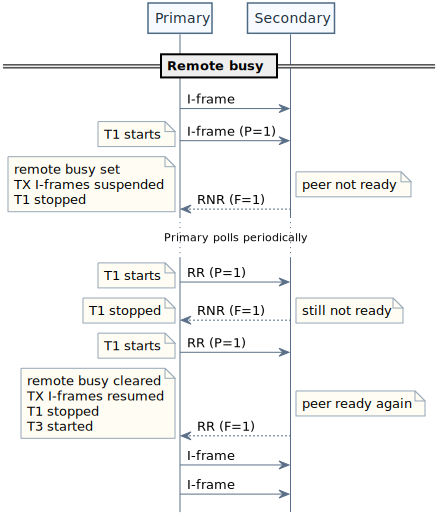
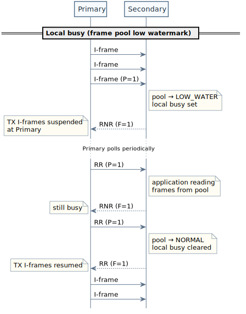

# HDLC Protocol Implementation

## Overview

This document describes the **ISO 13239 HDLC** (High-Level Data Link Control) protocol implementation in ioHdlc, including frame formats, operational modes, flow control, and error recovery mechanisms.

## HDLC Frame Structure

### Frame Format

**Classic (transparency encoding):**


**FFF (no transparency):**


### Field Descriptions

#### Flag (0x7E)

- **Purpose**: Frame delimiter
- **Value**: `01111110` (0x7E)
- **Position**: Start and end of frame
- **Byte Stuffing**: Any 0x7E in data is escaped

In HDLC, it is permitted for the closing flag of a frame to also serve as the opening flag of the next frame. In a continuous stream of frames, this means the same flag can act as a separator between consecutive frames, avoiding the need to transmit two distinct flags back-to-back. **This is the approach** adopted by **ioHdlc**, which takes advantage of this feature to optimize frame sequencing.

#### Address Field (8 bits)

- **Format**: `AAAAAAAA`
- **Address Space**: All 256 values are available
- **Reserved Values**:
  - `0x00`: no-station address
  - `0xFF`: all-stations address
- **Individual Station Addresses**: `0x01` to `0xFE`
- **Example**: Address `0x02` → `00000010`

#### Control Field

**8-bit Control (Modulo 8):**


- **N(S)**: Send sequence number (3 bits, 0-7)
- **N(R)**: Receive sequence number (3 bits, 0-7)
- **P/F**: Poll/Final bit
- **S**: Supervisory function (2 bits)
- **M**: Modifier bits (5 bits total)

**16-bit Control (Modulo 128):**


#### Frame Check Sequence (FCS)

- **Algorithm**: CRC-16-CCITT
- **Polynomial**: `x^16 + x^12 + x^5 + 1` (0x1021)
- **Initial Value**: 0xFFFF
- **Size**: 16 bits (2 bytes)
- **Transmission**: LSB first

### Byte Stuffing

To ensure flag uniqueness:

| Original Byte | Stuffed Sequence |
|--------------|------------------|
| 0x7E         | 0x7D 0x5E       |
| 0x7D         | 0x7D 0x5D       |

**Example:**
```
Original: 0x7E 0x03 0x7E 0x12
Stuffed:  0x7D 0x5E 0x03 0x7D 0x5E 0x12
```

### Frame Format Field (FFF)

An optional leading octet (or pair of octets) prepended to the frame that declares its total length, enabling DMA-friendly reception without byte-by-byte flag detection.

**Mutual exclusivity**: FFF and transparency (byte stuffing) are mutually exclusive — transparency alters frame length, which would invalidate the FFF-declared length.

**FFF Frame diagram:**


**FFF Types:**

| Type  | Size    | Format                        | Max Length |
|-------|---------|-------------------------------|------------|
| None  | 0 bytes | No FFF                        | —          |
| TYPE0 | 1 byte  | `0LLLLLLL` (bit 7 = 0)       | 127 bytes  |
| TYPE1 | 2 bytes | `1000LLLL LLLLLLLL` (12-bit)  | 4095 bytes |

Where L bits encode: `length = payload_len + fcs_size` (Address + Control + Data + FCS, excluding FFF itself and flags).

**TX processing order:**

1. Core builds frame (Address + Control + Data)
2. Driver calculates `total_wire_len = payload_len + fcs_size`
3. Driver writes FFF into `frame[0]` (or `frame[0..1]` for TYPE1)
4. Driver appends FCS after payload
5. Driver appends closing flag

**RX validation:**

1. Driver parses FFF from received frame
2. Compares declared length against actual received length
3. Mismatch → frame discarded

**Minimum frame lengths:**

- Without FFF: 4 bytes (`HDLC_BASIC_MIN_L`): Addr + Ctrl + FCS(2)
- With FFF: 5 bytes (`HDLC_FRFMT_MIN_L`): FFF + Addr + Ctrl + FCS(2)

## Frame Types

### Information Frames (I-frames)

**Purpose**: Carry user data

**Control Byte Format (Modulo 8):**
```
Bit:  7   6   5   4   3   2   1   0
      [N(R)   ]   P   [N(S)   ]   0
```

**Example:**
- N(S)=3, N(R)=5, P=0: `10100110` = 0xA6
- N(S)=0, N(R)=7, P=1: `11111000` = 0xF8

**Fields:**
- **N(S)**: Sequence number of this frame (0-7)
- **N(R)**: Expected next frame from peer (ACK)
- **P**: Poll bit (1 = checkpoint, request immediate response)

### Supervisory Frames (S-frames)

**Purpose**: Flow control, acknowledgment, error recovery

**Types:**

| Type | S-bits | Function            | Description                    |
|------|--------|---------------------|--------------------------------|
| RR   | 00     | Receive Ready       | Ready to receive, ACK N(R)-1  |
| RNR  | 01     | Receive Not Ready   | Not ready, ACK N(R)-1         |
| REJ  | 10     | Reject              | Error, retransmit from N(R)   |
| SREJ | 11     | Selective Reject    | Retransmit only N(R)          |

**Control Byte Format (Modulo 8, RR example):**
```
Bit:  7   6   5   4   3   2   1   0
     [N(R)    ]  P/F  0   0   0   1
```

**Examples:**
- RR N(R)=3, F=1: `01111001` = 0x79
- RNR N(R)=5, P=0: `10100101` = 0xA5
- REJ N(R)=0, F=1: `00011001` = 0x19

### Unnumbered Frames (U-frames)

**Purpose**: Link setup, disconnect, mode setting

**Common U-frames:**

| Command/Response | Control | P/F | Function                         |
|-----------------|---------|-----|----------------------------------|
| SNRM            | 0x83    | P   | Set Normal Response Mode         |
| UA              | 0x63    | F   | Unnumbered Acknowledgment        |
| DISC            | 0x43    | P   | Disconnect                       |
| DM              | 0x0F    | F   | Disconnected Mode                |
| FRMR            | 0x87    | F   | Frame Reject                     |
| UI              | 0x03    | -   | Unnumbered Information (no ACK)  |

**Control Byte Format (SNRM example):**
```
Bit:  7   6   5   4   3   2   1   0
      1   0   0   0   0   0   1   1
```

## Operational Modes

### Normal Disconnected Mode (NDM)

**State**: Link disconnected

**Characteristics:**
- No logical link established
- Stations may only exchange unnumbered frames for link management

**Allowed Frames:**
- **Commands**: SNRM, DISC, UI
- **Responses**: DM, UA

**Transitions:**
- NDM → NRM: Send SNRM → Receive UA
- NDM → ABM: Send SABM → Receive UA
- NDM → NDM: Send DISC → Receive DM

---

### Normal Response Mode (NRM)

**State**: Link established (unbalanced)

**Characteristics:**
- One station operates as **Primary**, others as **Secondary**
- The Primary controls the link and initiates all command exchanges
- Secondary stations transmit only:
  - in response to commands
  - or when explicitly polled
- Data transfer is governed by:
  - sequence variables (N(S), N(R))
  - **Poll/Final (P/F) cycle** for coordination and synchronization

**Allowed Frames:**
- **Commands (Primary → Secondary)**:
  - I-frames
  - S-frames (RR, RNR, REJ)
  - U-frames (DISC)
- **Responses (Secondary → Primary)**:
  - I-frames (when permitted)
  - S-frames (RR, RNR, REJ)
  - U-frames (UA)

**Transitions:**
- NRM → NDM: Send DISC → Receive UA

---

### Asynchronous Disconnected Mode (ADM)

**State**: Link disconnected (asynchronous)

**Characteristics:**
- No logical link established
- Station is not participating in a balanced or normal response relationship
- Used as the disconnected state for ABM
- The station responds independently to received commands

**Allowed Frames:**
- **Commands**: SABM, DISC, UI
- **Responses**: DM, UA

**Transitions:**
- ADM → ABM: Receive SABM → Send UA
- ADM → ADM: Receive DISC → Send DM

---

### Asynchronous Balanced Mode (ABM)

**State**: Link established (balanced)

**Characteristics:**
- Both stations operate as **peers**
- Either station may initiate transmission at any time
- No distinction between command and response based on role
- Full-duplex data transfer is supported
- Flow control and reliability rely on:
  - sequence variables (N(S), N(R))
  - **P/F bit for synchronization and recovery**

**Allowed Frames:**
- **Both directions**:
  - I-frames
  - S-frames (RR, RNR, REJ)
  - U-frames (DISC)

**Transitions:**
- ADM → ABM: Send SABM → Receive UA
- ABM → ADM: Send DISC → Receive UA

---

## Transmission Behaviors

### Two-Way Alternating (TWA)

**Definition**:  
Transmission alternates between stations, with only one station actively sending I-frames at a time.

**Characteristics:**
- At any given time, only one station transmits I-frames
- The transmitting role alternates between stations
- In NRM, alternation is coordinated by the **P/F cycle**
- In ABM, alternation may arise from implementation policy or link conditions
- Each exchange naturally establishes a **synchronization checkpoint**

**Properties:**
- Deterministic operation
- Strong synchronization guarantees
- Lower throughput due to serialized transmission

---

### Two-Way Simultaneous (TWS)

**Definition**:  
Both stations may transmit I-frames independently without waiting for explicit polls.

**Characteristics:**
- Bidirectional data flow using sliding windows
- No strict alternation of transmission
- P/F is still used for:
  - synchronization
  - checkpointing when required

**Benefits:**
- Higher throughput
- Lower latency
- Efficient full-duplex utilization

**Requirements:**
- Both stations must support TWS
- Independent transmit and receive window management
- Correct handling of sequence variables in both directions

---

## TWA vs TWS

| Aspect | TWA | TWS |
|------|-----|-----|
| Transmission | Alternating | Simultaneous |
| Control | P/F-driven | Window-driven |
| Synchronization | Implicit (frequent) | Explicit (on demand via P/F) |
| Throughput | Lower | Higher |

---

@note TWS does not remove the need for P/F-based synchronization; it only relaxes transmission alternation.

## Sequence Numbering

### Variables

**Per Station:**
- **V(S)**: Send state variable (next N(S) to send)
- **V(R)**: Receive state variable (next N(R) expected)
- **V(A)**: Acknowledge state variable (oldest unacknowledged N(S))

**Per Frame:**
- **N(S)**: Send sequence number in I-frame
- **N(R)**: Receive sequence number (ACK) in I/S-frame

### Modulo 8 Example

```
Station A:                       Station B:
V(S)=0, V(R)=0, V(A)=0          V(S)=0, V(R)=0, V(A)=0

Send I0,0 ──────────────────────────> Receive I0,0
V(S)=1                                 V(R)=1

                <──────────────────── Send I0,1 (ACK I0)
V(A)=1 (ACK'd)                        V(S)=1

Send I1,1 ──────────────────────────> Receive I1,1
V(S)=2                                 V(R)=2

                <──────────────────── Send RR,2 (ACK I1)
V(A)=2
```

### Sequence Number Arithmetic

**Modulo 8:**
- Range: 0-7
- Next: (N + 1) mod 8

**Example:**
```c
uint8_t next_seq(uint8_t n) {
  return (n + 1) & 0x07;
}
```

## Flow Control & Windowing

### Window Size

**Definition**: Maximum number of unacknowledged I-frames

**Modulo 8**: Window size ≤ 7 (not 8, to avoid ambiguity)
**Modulo 128**: Window size ≤ 127

### Window Management

**Send Window:**
```
V(A) = oldest unacknowledged
V(S) = next to send

Window: [V(A) ... V(S)-1]

If (V(S) - V(A)) mod 8 >= 7:
  Window full, cannot send
```

**Receive Window:**
```
V(R) = next expected

Window: [V(R) ... V(R)+6]

Frames outside window: discarded or buffered
```

### Example: Window Full

```
Station A sends 7 I-frames without ACK:
V(S)=7, V(A)=0

Window: [0, 1, 2, 3, 4, 5, 6]
Window size: (7 - 0) mod 8 = 7 (FULL)

Cannot send I7 until ACK received.

Station B sends RR,4 (ACK 0-3):
V(A)=4

Window size: (7 - 4) mod 8 = 3
Can send 4 more frames (I7, I0, I1, I2)
```

## Busy States and Flow Control

**ioHdlc** defines two independent busy conditions that both use the RNR/RR
supervisory-frame pair to suspend and resume I-frame transmission.

### Remote Busy

**Trigger**: An RNR frame is received from the remote station.

The remote station is signalling that it cannot accept further I-frames.
I-frame transmission toward that peer is suspended until an RR frame is
received. In NRM, the primary station continues to poll the secondary periodically to detect when it returns to the ready state.



### Local Busy — Frame Pool Backpressure

**Trigger**: The local frame pool drops to or below the LOW_WATER threshold
(default: ≤ 20% free frames).

When the receiver cannot obtain free frames fast enough to keep pace with
incoming I-frames, continuing to accept data would risk pool exhaustion.
ioHdlc handles this automatically: as soon as the LOW_WATER threshold is
crossed while accepting an incoming I-frame, the station signals busy to
the remote side by sending RNR. No application involvement is required.

When the application consumes buffered frames via `ioHdlcReadTmo` and the
pool recovers above the HIGH_WATER threshold (default: > 60% free), the
station sends RR and the remote side resumes transmission.

The gap between LOW_WATER and HIGH_WATER (hysteresis) prevents rapid
RNR/RR oscillations under sustained load.

| Threshold  | Condition            | Action                    |
|------------|----------------------|---------------------------|
| LOW_WATER  | free ≤ 20% of total  | Set local busy, send RNR  |
| HIGH_WATER | free > 60% of total  | Clear local busy, send RR |



### Write-Side Backpressure

The busy mechanism propagates upstream to the application automatically.
`ioHdlcWriteTmo` blocks (subject to the caller-specified timeout) when:

- the number of unacknowledged frames pending acknowledgment is high, or
- the frame pool is in LOW_WATER state.

As a result the application cannot outrun the link: memory pressure on the
pool translates directly into back-pressure on the writer, without any
frame loss.

## Error Recovery

### REJ (Reject) - Go-Back-N

**Trigger**: Frame out of sequence

**Action:**
1. Station B expects I2, receives I3 (I2 lost)
2. Station B sends REJ,2 (retransmit from I2)
3. Station A retransmits I2, I3, I4, ... (all since I2)

**Pros:** Simple
**Cons:** Retransmits frames already received (and discarded)

### Checkpoint Retransmission

**Trigger**: Timeout or explicit poll

**Action:**
1. Station A sends I6 with P=1 (checkpoint)
2. Starts timer
3. If no response before timeout:
   - Retransmit all unacknowledged frames
4. Station B must respond with F=1

### SREJ (Selective Reject)

**Trigger**: Frame out of sequence (optional function)

**Action:**
1. Station B expects I2, receives I3 (I2 lost)
2. Station B buffers I3
3. Station B sends SREJ,2 (retransmit only I2)
4. Station A retransmits only I2
5. Station B delivers I2, then I3 (in order)

**Pros:** Efficient (no redundant retransmissions)
**Cons:** Requires frame buffering

## Timer Management

### T1 Timer (Reply Timeout)

**Purpose**: Detect lost frames or unresponsive peer

**Start**: When checkpoint sent (I-frame with P=1)
**Stop**: When response with F=1 received
**Expiry**: Force poll (set need_p), increment retry counter (N2). If N2 exceeded → link down.

**Configuration:**
```c
config.reply_timeout_ms = 100;   // IOHDLC_REPLY_TIMEOUT_MS_DEFAULT
config.poll_retry_max = 8;       // IOHDLC_POLL_RETRY_MAX_DEFAULT
```

`reply_timeout_ms` is the base T1 value. On each reply-timeout expiry, the
next T1 window is doubled using the current retry count. In other words, the
recovery wait is not linear:

```
T1(n) = reply_timeout_ms << n
```

This makes large `poll_retry_max` values expensive very quickly. Even moderate
settings can push the cumulative wait into the tens of seconds, so `reply_timeout_ms`
and `poll_retry_max` must be tuned together.

#### T1 Sizing Formula

The T1 value must account for **all system latencies** to prevent false timeouts:

```
T1 >= (ks × frame_tx_time_max) + wire_RTT + peer_processing + safety_margin
```

**Components:**

- **ks × frame_tx_time_max**: Maximum queue depth latency
  - `ks`: Window size (e.g., 7 frames)
  - `frame_tx_time_max`: Time to transmit largest frame at configured baudrate
  - Example (2 Mbps, 256 bytes): `256 bytes × 10 bits/byte / 2,000,000 bps = 1.28 ms`

- **wire_RTT**: Physical propagation delay (typically 0.1-1 ms for short distances)

- **peer_processing**: Time for peer to process command and generate response (typically 1-5 ms)

- **safety_margin**: Additional buffer for system jitter and scheduling delays (typically 2-10 ms)

**Example Calculation:**

```
Baudrate: 2 Mbps
Frame size: 256 bytes
Window size (ks): 7
wire_RTT: 0.1 ms
Peer processing: 2 ms
Safety margin: 5 ms

frame_tx_time = (256 × 10) / 2,000,000 = 1.28 ms
T1 >= (7 × 1.28) + 0.1 + 2 + 5 = 16.06 ms  →  use T1 = 20 ms
```

**Guidelines:**

- **Low baudrates (≤115200 bps)**: Increase T1 significantly (100-500 ms)
- **Moderate baudrates (115200 bps – 2 Mbps)**: T1 in the range 20-100 ms
- **High baudrates (2–10 Mbps)**: T1 can be low (5-20 ms); peer processing dominates
- **Very high baudrates (≥10 Mbps)**: T1 dominated entirely by peer processing and OS jitter (2-10 ms)
- **Large window sizes (ks > 7)**: Scale T1 proportionally
- **Hardware TX queues**: Include queue depth in calculation (e.g., ISR-based TX pipeline)

**Note**: This applies to **any** system with non-blocking transmission (DMA, ISR queues, etc.), not just queue-based implementations. The driver returns immediately after DMA start, but T1 must account for the physical transmission time.

### T3 Timer (Idle Poll)

**Purpose**: Detect prolonged idle periods; keep the link alive by forcing a poll when no activity occurs.

**Duration**: `T1 × IOHDLC_DFL_T3_T1_RATIO` (default ratio = 5). With T1 = 100ms → T3 = 500ms.

**Lifecycle:**

- **Start**: After receiving F=1 response (link confirmed responsive), T1 stops, T3 starts.
- **Restart**: On receiving F=0 frames while T3 is running (secondary still active).
- **Stop**: When primary sends a new poll (P=1) → T1 starts, T3 stops.
- **Expiry**: Sets the `need_p` flag → next outbound frame (I or S) carries P=1, starting a new T1 cycle.


## Poll/Final Bit

### Poll Bit (P=1)

**Usage**: In commands from primary
**Meaning**: "Respond immediately"

**When Set:**
- Checkpoint: request ACK status
- Link test: verify peer is alive
- RNR recovery: check if peer ready

### Final Bit (F=1)

**Usage**: In responses from secondary
**Meaning**: "This is the response to your poll"

**When Set:**
- Response to P=1 command
- Must match the poll that triggered it

### Example: Checkpoint Cycle

```
Primary:                           Secondary:

Send I6,P=1 ──────────────────────>
Start T1 timer                      Receive I6,P=1
                                    Must respond with F=1

                <─────────────────── Send RR,7,F=1
Stop T1 timer                       (ACK frames 0-6)
V(A) = 7
```

## Link Initialization

### Connection Establishment

```
Primary:                           Secondary:

SNRM,P=1 ────────────────────────>
                                   Initialize state:
                                   V(S)=0, V(R)=0, V(A)=0

                <────────────────── UA,F=1
Initialize state:
V(S)=0, V(R)=0, V(A)=0

[Link established, NRM]
```

### Disconnect

```
Primary:                           Secondary:

DISC,P=1 ────────────────────────>
                                   Clear state, enter NDM

                <────────────────── UA,F=1
Clear state, enter NDM

[Link disconnected, NDM]
```

## Addressing

### Address Field

**Single-octet addressing (used by ioHdlc):**
- All 256 combinations are available
- `0x00`: no-station address
- `0xFF`: all-stations address
- `0x01` to `0xFE`: individual station addresses

**Extended addressing:**
- Defined by the HDLC standard
- Not used by ioHdlc

**Examples:**
```
Single byte:  0x01 = 00000001 (station 1)
Single byte:  0x02 = 00000010 (station 2)
Single byte:  0x00 = 00000000 (no-station)
Single byte:  0xFF = 11111111 (all-stations)
```

### Broadcast Address

**Convention**: 0xFF (all 1s)
**Usage**: Commands to all stations (e.g., UI frames)

## Implementation-Specific Details

### Supported Modes

- ✅ NRM (Normal Response Mode)
- ✅ TWS (Two-Way Simultaneous)
- ✅ TWA (Two-Way Alternate)
- ✅ ABM (Asynchronous Balanced Mode)

### Supported Functions

- ✅ I-frames (Information)
- ✅ RR (Receive Ready)
- ✅ RNR (Receive Not Ready)
- ✅ REJ (Reject) - optional, configurable
- ❌ SREJ (Selective Reject) - not implemented
- ✅ SNRM (Set Normal Response Mode)
- ✅ UA (Unnumbered Acknowledgment)
- ✅ DISC (Disconnect)
- ✅ DM (Disconnected Mode)
- ✅ UI (Unnumbered Information) - optional

### Window Sizes

**Modulo 8:**
- Window size: 7 (default)
- Configurable: 1-7

**Modulo 128:**
- Window size: 127 (default)
- Configurable: 1-127

### Timeouts

**Default Values:**
```c
reply_timeout_ms = 100;      // T1: IOHDLC_REPLY_TIMEOUT_MS_DEFAULT
poll_retry_max = 8;          // IOHDLC_POLL_RETRY_MAX_DEFAULT
```

**Platform-Specific:**
- Linux: POSIX timers (timer_create)
- ChibiOS: Virtual timers (chVTSet)

## Frame Examples

### Example 1: SNRM (Set Normal Response Mode)

```
Raw bytes: 7E 03 83 B9 50 7E

7E      - Flag
03      - Address (station 1)
83      - Control (SNRM, P=1)
B9 50   - FCS (CRC-16)
7E      - Flag
```

### Example 2: I-frame with Data

```
Raw bytes: 7E 03 00 48 45 4C 4C 4F 5C 8A 7E

7E          - Flag
03          - Address (station 1)
00          - Control (I0,0, N(S)=0, N(R)=0)
48 45 4C 4C 4F - Data ("HELLO")
5C 8A       - FCS
7E          - Flag
```

### Example 3: RR (Receive Ready)

```
Raw bytes: 7E 03 21 C2 14 7E

7E      - Flag
03      - Address
21      - Control (RR,4, N(R)=4, P=0)
                  [010 | 0 | 00 | 01]
                   N(R)  P  RR  S-frame
C2 14   - FCS
7E      - Flag
```

### Example 4: Byte Stuffing Example

```
Original data: 7E 7D 12

Frame: 7E 03 00 [7E 7D 12] FCS 7E
       
After stuffing:
7E 03 00 7D 5E 7D 5D 12 FCS 7E
         ^^^^^  ^^^^^
         0x7E   0x7D stuffed
```

## State Machine

### Link State Transitions

```
        ┌───────────────────────────────┐
        │                               │
        │     NDM/ADM (Disconnected)    │
        │                               │
        └───────┬───────────────┬───────┘
                │               │
         SNRM/UA│               │DISC/UA
                │               │
                v               │
        ┌───────────────────────┼───────┐
        │                       │       │
        │    NRM/ABM (Connected)│       │
        │                       │       │
        └───────────────────────────────┘
```

### Frame Processing State


## Error Handling

### FCS Error

**Detection**: CRC mismatch
**Action**: Discard frame, do not ACK
**Recovery**: Checkpoint procedure (P-bit poll) or reply timeout

### Sequence Error

**Detection**: N(S) ≠ V(R)
**Action**: 
- If REJ enabled: Send REJ,V(R)
- Otherwise: Discard, wait for retransmission

### Timer Expiry

**Detection**: No response within T1 timeout
**Action**:
1. Increment retry counter
2. Retransmit unacknowledged frames
3. If retry_count > max: declare link failure

### Frame Reject (FRMR)

The FRMR response reports an unrecoverable protocol error to the remote
station (ISO 13239, 5.5.3).

**Trigger conditions (secondary/combined station):**
- Invalid N(R) received (identifies an already-acknowledged or
  not-yet-transmitted frame)

**Behaviour when FRMR condition is active:**
- The secondary sends FRMR at the first respond opportunity
- FRMR is repeated at every subsequent poll (P=1)
- I-frame transmission is suppressed
- Incoming I/S-frames are discarded (only P bit is examined)

**FRMR information field** (3 bytes mod 8, 5 bytes mod 128):
- Rejected control field
- Current V(S) and V(R)
- C/R bit of the rejected frame
- Reason bits: W (invalid control), X (info not permitted),
  Y (invalid N(R)), Z (info too long)

**Recovery:**
- The primary receives FRMR and is notified via the
  `IOHDLC_APP_FRMR_RECEIVED` application event
- Recovery is a higher-layer responsibility (ISO 13239)
- The primary must issue a mode setting command (DISC followed by SNRM)
  to clear the condition and re-establish the link
- DISC and SNRM are accepted by the secondary even during FRMR condition

## Performance Considerations

### Throughput

The transmitter sends frames back-to-back up to the window limit `ks`. ACKs
(piggybacked on reverse I-frames or as standalone RR) arrive while new frames
are still being transmitted. The ACK for the first frame of a burst arrives
after one **round-trip time**:

```
RTT = Ttx + 2 × Tp

  Ttx = Frame_Size × 8 / Baudrate   (transmission time of one frame)
  Tp  = one-way delay: propagation + any hidden latencies
        (interrupt handling, driver buffering, peer processing, OS scheduling)
```

In `RTT` seconds the transmitter can place `RTT / Ttx` frames on the wire.
To keep the channel continuously busy the window must satisfy:

```
W_min = ceil(RTT / Ttx) = ceil(1 + 2 × Tp / Ttx)
```

| Condition   | Regime          | Channel utilisation    |
|-------------|-----------------|------------------------|
| W >= W_min  | channel-limited | ≈ Payload / Frame_Size |
| W < W_min   | window-limited  | W × Ttx / RTT          |

**Example A — 2 Mbps SPI, short cable (Tp = 0.05 ms), 128-byte frames:**
```
Ttx   = 128 × 8 / 2,000,000  = 0.512 ms
RTT   = 0.512 + 2 × 0.05     = 0.612 ms
W_min = ceil(0.612 / 0.512)  = 2 frames

W = 7 >> W_min  →  channel-limited
Throughput = 2 Mbps × 122/128 ≈ 1.91 Mbps
```

The ACK for frame 0 arrives at t ≈ 0.612 ms; the transmitter has only sent
frame 1 by then. A window of 7 is more than sufficient.

**Example B — 10 Mbps link with latency (Tp = 1 ms), 128-byte frames:**
```
Ttx   = 128 × 8 / 10,000,000 = 0.102 ms
RTT   = 0.102 + 2 × 1.0      = 2.102 ms
W_min = ceil(2.102 / 0.102)  = 21 frames

With modulo 8 (W = 7):
  W < W_min  →  window-limited
  Utilisation = 7 × 0.102 / 2.102 ≈ 34%
  Throughput  ≈ 0.34 × 10 Mbps × 122/128 ≈ 3.25 Mbps

With modulo 128 (W = 127):
  W >> W_min  →  channel-limited
  Throughput  ≈ 10 Mbps × 122/128 ≈ 9.53 Mbps
```

This is the core motivation for modulo 128: on high-speed or high-latency
links a window of 7 leaves most of the channel bandwidth unused.

### Efficiency

**Overhead per frame:**
```
Flag (1) + Address (1) + Control (1) + FCS (2) + Flag (1) = 6 bytes

Efficiency = Data / (Data + Overhead + Stuffing)

Example (128-byte data):
Efficiency ≈ 128 / (128 + 6) ≈ 95.5%
```

### Latency

**Best case (no errors, TWS):**
```
Latency = Propagation_Delay + (Frame_Size / Baud_Rate)

Example (2 Mbps, 256 bytes):
Latency ≈ 0 + (2048 bits / 2,000,000) ≈ 1.02 ms
```

### Why Large Frames Are an Anti-Pattern in Embedded HDLC Designs

We have seen above that ioHdlc supports FFF field TYPE0 and TYPE1, which limit the net payload length to 120 and 4087 bytes respectively. This should **not** be considered a limitation of ioHdlc.
When designing HDLC-based communication stacks for embedded systems, it is tempting to increase frame size in order to improve throughput. At a superficial level, this appears reasonable: larger frames reduce protocol overhead and therefore increase efficiency. However, in practice—especially on resource-constrained systems this approach introduces significant drawbacks. Modern communication systems have converged on a different strategy: moderate frame sizes combined with windowing, flow control, and efficient memory management.

Ethernet, for example, provides a useful reference point. Despite operating on high-speed and highly reliable links, it defines a standard MTU of 1500 bytes, with optional jumbo frames around 9000 bytes used only in controlled environments. This limit is not arbitrary. It reflects a carefully balanced trade-off between throughput, latency, error recovery, memory usage, and fairness. Even in systems far more capable than typical embedded devices, very large frames are avoided because they degrade overall system behavior.

#### The Limited Benefit of Large Frames

The only meaningful advantage of large frames is the reduction of protocol overhead. As payload size increases, the relative cost of headers and checksums decreases. While this improves theoretical efficiency, it does not account for real-world conditions such as transmission errors, buffering constraints, and system responsiveness. In embedded systems, these factors dominate.

Large frames occupy the communication channel for longer periods of time. On a UART link at 115200 baud, a 32 KB frame can take several seconds to transmit; even at 1 Mbps, it still introduces substantial delay. During this time, no other traffic can be interleaved. Control messages are delayed, system responsiveness degrades, and real-time behavior becomes difficult to guarantee. This alone is often sufficient to rule out large frames in embedded designs.

**Error Recovery Costs**

HDLC retransmits data at frame granularity. This means that a single bit error invalidates the entire frame. As frame size increases, the cost of a single error grows proportionally. Under realistic bit error rates, this leads to a sharp drop in effective throughput. Instead of improving performance, large frames can make the system significantly less efficient.

**Memory Pressure**

Large frames require larger buffers and longer buffer lifetimes. On embedded systems, where memory is limited and often statically allocated, this creates immediate pressure. Buffers remain occupied for longer periods, reducing availability for other operations. Fragmentation risks increase, and the overall system becomes less predictable. These effects are particularly problematic on systems where memory constraints are tight.

**Flow Control Limitations**

Flow control mechanisms such as RNR/RR rely on timely feedback. With large frames, this feedback becomes coarse and delayed. By the time the receiver detects memory pressure and signals it, a large frame may already be in transit. This reduces the effectiveness of back pressure and increases the likelihood of overflow or forced drops.

**DMA is not everything**

While DMA can efficiently transfer data between peripherals and memory, it does not eliminate the fundamental issues associated with large frames. Frame validation still requires CRC computation, HDLC framing still requires parsing, and buffers must remain allocated until the entire frame is received and validated. DMA improves data movement efficiency, but it does not address latency, error recovery, or memory pressure.

#### A Better Approach: Windowing and Pipelining

Modern communication systems achieve high throughput not by increasing frame size, but by increasing pipeline depth. Throughput scales with the product of window size and frame size, divided by round-trip time. This means that multiple smaller frames in flight can outperform a single large frame. Smaller frames reduce latency, improve error recovery, and allow finer-grained flow control, while windowing preserves throughput. This is the same principle used in Ethernet and higher-level protocols such as TCP.

An efficient embedded HDLC implementation should focus on balanced frame sizing rather than maximization. In practice, frame sizes in the range of a few dozen to a few hundred bytes provide a good compromise between efficiency and responsiveness. Performance should instead be driven by mechanisms such as sliding windows, selective retransmission, checkpointing, and explicit flow control. Efficient memory management techniques, including zero-copy designs and frame pools, further improve system behavior by reducing overhead and increasing predictability.

Large frames are often perceived as a straightforward way to improve throughput, but in embedded HDLC systems they are typically counterproductive.
A well-designed system prioritizes responsiveness, robustness, and efficient resource usage. By keeping frame sizes moderate and relying on windowing and flow control, it is possible to achieve high throughput without sacrificing reliability or system stability.
Ultimately, performance in embedded communication systems is not achieved by maximizing frame size, but by carefully balancing protocol design, memory management, and data flow.

## References

- ISO 13239:2002 - HDLC Procedures
- ITU-T Recommendation X.25 - Link Layer
- HDLC Wikipedia: https://en.wikipedia.org/wiki/High-Level_Data_Link_Control
