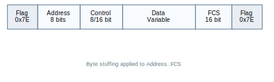
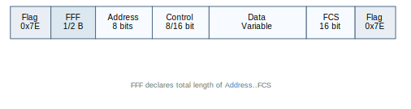
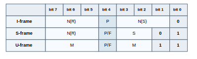
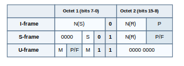
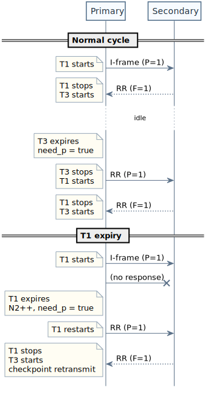
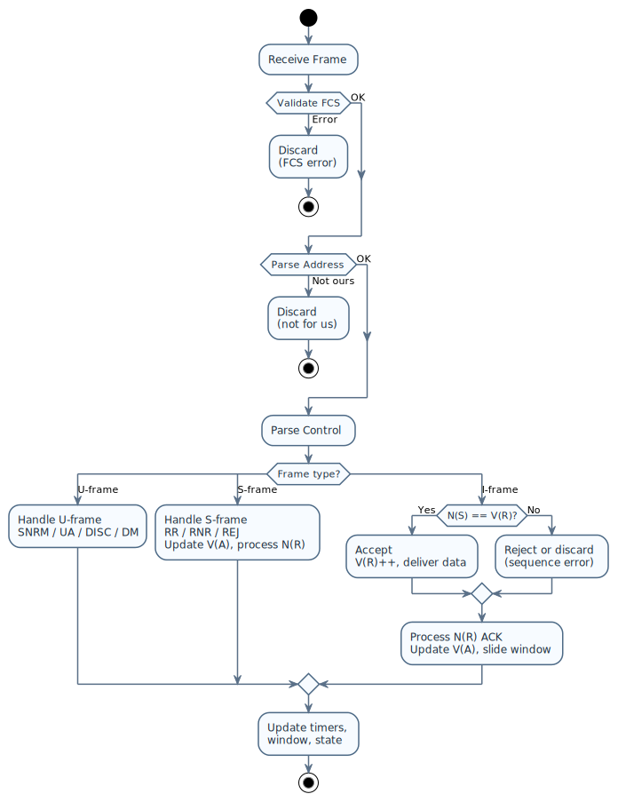

# HDLC Protocol Implementation

## Overview

This document describes the **ISO 13239 HDLC** (High-Level Data Link Control) protocol implementation in ioHdlc, including frame formats, operational modes, flow control, and error recovery mechanisms.

## HDLC Frame Structure

### Frame Format

**Classic (transparency encoding):**



**FFF (no transparency):**



### Field Descriptions

#### Flag (0x7E)

- **Purpose**: Frame delimiter
- **Value**: `01111110` (0x7E)
- **Position**: Start and end of frame
- **Byte Stuffing**: Any 0x7E in data is escaped

#### Address Field (8 bits)

- **Format**: `AAAAAAAP` (7-bit address + 1-bit P/F)
- **Address**: Bits 7-1 (0-127)
- **Extension Bit**: Bit 0 (always 1 in 8-bit addressing)
- **Example**: Address 0x03 → `00000011`

#### Control Field

**8-bit Control (Modulo 8):**



- **N(S)**: Send sequence number (3 bits, 0-7)
- **N(R)**: Receive sequence number (3 bits, 0-7)
- **P/F**: Poll/Final bit
- **S**: Supervisory function (2 bits)
- **M**: Modifier bits (5 bits total)

**16-bit Control (Modulo 128):**



#### Frame Check Sequence (FCS)

- **Algorithm**: CRC-16-CCITT
- **Polynomial**: `x^16 + x^12 + x^5 + 1` (0x1021)
- **Initial Value**: 0xFFFF
- **Size**: 16 bits (2 bytes)
- **Transmission**: LSB first

### Byte Stuffing

To ensure flag uniqueness:

| Original Byte | Stuffed Sequence |
|--------------|------------------|
| 0x7E         | 0x7D 0x5E       |
| 0x7D         | 0x7D 0x5D       |

**Example:**
```
Original: 0x7E 0x03 0x7E 0x12
Stuffed:  0x7D 0x5E 0x03 0x7D 0x5E 0x12
```

### Frame Format Field (FFF)

An optional leading octet (or pair of octets) prepended to the frame that declares its total length, enabling DMA-friendly reception without byte-by-byte flag detection.

**Mutual exclusivity**: FFF and transparency (byte stuffing) are mutually exclusive — transparency alters frame length, which would invalidate the FFF-declared length.

**Frame diagrams:**


**FFF Types:**

| Type  | Size    | Format                        | Max Length |
|-------|---------|-------------------------------|------------|
| None  | 0 bytes | No FFF                        | —          |
| TYPE0 | 1 byte  | `0LLLLLLL` (bit 7 = 0)       | 127 bytes  |
| TYPE1 | 2 bytes | `1000LLLL LLLLLLLL` (12-bit)  | 4095 bytes |

Where L bits encode: `length = payload_len + fcs_size` (Address + Control + Data + FCS, excluding FFF itself and flags).

**TX processing order:**

1. Core builds frame (Address + Control + Data)
2. Driver calculates `total_wire_len = payload_len + fcs_size`
3. Driver writes FFF into `frame[0]` (or `frame[0..1]` for TYPE1)
4. Driver appends FCS after payload
5. Driver appends closing flag

**RX validation:**

1. Driver parses FFF from received frame
2. Compares declared length against actual received length
3. Mismatch → frame discarded

**Minimum frame lengths:**

- Without FFF: 4 bytes (`HDLC_BASIC_MIN_L`): Addr + Ctrl + FCS(2)
- With FFF: 5 bytes (`HDLC_FRFMT_MIN_L`): FFF + Addr + Ctrl + FCS(2)

## Frame Types

### Information Frames (I-frames)

**Purpose**: Carry user data

**Control Byte Format (Modulo 8):**
```
Bit:  7   6   5   4   3   2   1   0
      [N(R)   ]   P   [N(S)   ]   0
```

**Example:**
- N(S)=3, N(R)=5, P=0: `10100110` = 0xA6
- N(S)=0, N(R)=7, P=1: `11111000` = 0xF8

**Fields:**
- **N(S)**: Sequence number of this frame (0-7)
- **N(R)**: Expected next frame from peer (ACK)
- **P**: Poll bit (1 = checkpoint, request immediate response)

### Supervisory Frames (S-frames)

**Purpose**: Flow control, acknowledgment, error recovery

**Types:**

| Type | S-bits | Function            | Description                    |
|------|--------|---------------------|--------------------------------|
| RR   | 00     | Receive Ready       | Ready to receive, ACK N(R)-1  |
| RNR  | 01     | Receive Not Ready   | Not ready, ACK N(R)-1         |
| REJ  | 10     | Reject              | Error, retransmit from N(R)   |
| SREJ | 11     | Selective Reject    | Retransmit only N(R)          |

**Control Byte Format (Modulo 8, RR example):**
```
Bit:  7   6   5   4   3   2   1   0
     [N(R)    ]  P/F  0   0   0   1
```

**Examples:**
- RR N(R)=3, F=1: `01111001` = 0x79
- RNR N(R)=5, P=0: `10100101` = 0xA5
- REJ N(R)=0, F=1: `00011001` = 0x19

### Unnumbered Frames (U-frames)

**Purpose**: Link setup, disconnect, mode setting

**Common U-frames:**

| Command/Response | Control | P/F | Function                         |
|-----------------|---------|-----|----------------------------------|
| SNRM            | 0x83    | P   | Set Normal Response Mode         |
| UA              | 0x63    | F   | Unnumbered Acknowledgment        |
| DISC            | 0x43    | P   | Disconnect                       |
| DM              | 0x0F    | F   | Disconnected Mode                |
| FRMR            | 0x87    | F   | Frame Reject (receive-only¹)     |
| UI              | 0x03    | -   | Unnumbered Information (no ACK)  |

**Control Byte Format (SNRM example):**
```
Bit:  7   6   5   4   3   2   1   0
      1   0   0   0   0   0   1   1
```

## Operational Modes

### Normal Disconnected Mode (NDM)

**State**: Link disconnected

**Allowed Frames:**
- **Commands**: SNRM, DISC, UI
- **Responses**: DM, UA

**Transitions:**
- NDM → NRM: Send SNRM → Receive UA
- NDM → NDM: Send DISC → Receive DM

### Normal Response Mode (NRM)

**State**: Link established

**Characteristics:**
- Primary initiates commands
- Secondary responds to polls
- I-frames can flow bidirectionally (in TWS)

**Allowed Frames:**
- **Commands**: I-frames, S-frames (RR, RNR, REJ), U-frames (DISC)
- **Responses**: I-frames, S-frames (RR, RNR, REJ), U-frames (UA)

**Transitions:**
- NRM → NDM: Send DISC → Receive UA

### Two-Way Simultaneous (TWS)

**Extension**: Both stations can send I-frames simultaneously without explicit polls

**Benefits:**
- Higher throughput
- Lower latency
- Full-duplex operation

**Requirements:**
- Both stations must support TWS
- Window management for both directions

## Sequence Numbering

### Variables

**Per Station:**
- **V(S)**: Send state variable (next N(S) to send)
- **V(R)**: Receive state variable (next N(R) expected)
- **V(A)**: Acknowledge state variable (oldest unacknowledged N(S))

**Per Frame:**
- **N(S)**: Send sequence number in I-frame
- **N(R)**: Receive sequence number (ACK) in I/S-frame

### Modulo 8 Example

```
Station A:                       Station B:
V(S)=0, V(R)=0, V(A)=0          V(S)=0, V(R)=0, V(A)=0

Send I0,0 ──────────────────────────> Receive I0,0
V(S)=1                                 V(R)=1

                <──────────────────── Send I0,1 (ACK I0)
V(A)=1 (ACK'd)                        V(S)=1

Send I1,1 ──────────────────────────> Receive I1,1
V(S)=2                                 V(R)=2

                <──────────────────── Send RR,2 (ACK I1)
V(A)=2
```

### Sequence Number Arithmetic

**Modulo 8:**
- Range: 0-7
- Next: (N + 1) mod 8

**Example:**
```c
uint8_t next_seq(uint8_t n) {
  return (n + 1) & 0x07;
}
```

## Flow Control & Windowing

### Window Size

**Definition**: Maximum number of unacknowledged I-frames

**Modulo 8**: Window size ≤ 7 (not 8, to avoid ambiguity)
**Modulo 128**: Window size ≤ 127

### Window Management

**Send Window:**
```
V(A) = oldest unacknowledged
V(S) = next to send

Window: [V(A) ... V(S)-1]

If (V(S) - V(A)) mod 8 >= 7:
  Window full, cannot send
```

**Receive Window:**
```
V(R) = next expected

Window: [V(R) ... V(R)+6]

Frames outside window: discarded or buffered
```

### Example: Window Full

```
Station A sends 7 I-frames without ACK:
V(S)=7, V(A)=0

Window: [0, 1, 2, 3, 4, 5, 6]
Window size: (7 - 0) mod 8 = 7 (FULL)

Cannot send I7 until ACK received.

Station B sends RR,4 (ACK 0-3):
V(A)=4

Window size: (7 - 4) mod 8 = 3
Can send 4 more frames (I7, I0, I1, I2)
```

## Error Recovery

### REJ (Reject) - Go-Back-N

**Trigger**: Frame out of sequence

**Action:**
1. Station B expects I2, receives I3 (I2 lost)
2. Station B sends REJ,2 (retransmit from I2)
3. Station A retransmits I2, I3, I4, ... (all since I2)

**Pros:** Simple
**Cons:** Retransmits frames already received (and discarded)

### Checkpoint Retransmission

**Trigger**: Timeout or explicit poll

**Action:**
1. Station A sends I6 with P=1 (checkpoint)
2. Starts timer
3. If no response before timeout:
   - Retransmit all unacknowledged frames
4. Station B must respond with F=1

### SREJ (Selective Reject)

**Trigger**: Frame out of sequence (optional function)

**Action:**
1. Station B expects I2, receives I3 (I2 lost)
2. Station B buffers I3
3. Station B sends SREJ,2 (retransmit only I2)
4. Station A retransmits only I2
5. Station B delivers I2, then I3 (in order)

**Pros:** Efficient (no redundant retransmissions)
**Cons:** Requires frame buffering

## Timer Management

### T1 Timer (Reply Timeout)

**Purpose**: Detect lost frames or unresponsive peer

**Start**: When checkpoint sent (I-frame with P=1)
**Stop**: When response with F=1 received
**Expiry**: Force poll (set need_p), increment retry counter (N2). If N2 exceeded → link down.

**Configuration:**
```c
config.reply_timeout_ms = 100;   // 100ms (default)
config.poll_retry_max = 5;       // Max retries (default)
```

#### T1 Sizing Formula

The T1 value must account for **all system latencies** to prevent false timeouts:

```
T1 >= (ks × frame_tx_time_max) + wire_RTT + peer_processing + safety_margin
```

**Components:**

- **ks × frame_tx_time_max**: Maximum queue depth latency
  - `ks`: Window size (e.g., 7 frames)
  - `frame_tx_time_max`: Time to transmit largest frame at configured baudrate
  - Example (2 Mbps, 256 bytes): `256 bytes × 10 bits/byte / 2,000,000 bps = 1.28 ms`

- **wire_RTT**: Physical propagation delay (typically 0.1-1 ms for short distances)

- **peer_processing**: Time for peer to process command and generate response (typically 1-5 ms)

- **safety_margin**: Additional buffer for system jitter and scheduling delays (typically 2-10 ms)

**Example Calculation:**

```
Baudrate: 2 Mbps
Frame size: 256 bytes
Window size (ks): 7
wire_RTT: 0.1 ms
Peer processing: 2 ms
Safety margin: 5 ms

frame_tx_time = (256 × 10) / 2,000,000 = 1.28 ms
T1 >= (7 × 1.28) + 0.1 + 2 + 5 = 16.06 ms  →  use T1 = 20 ms
```

**Guidelines:**

- **Low baudrates (≤115200 bps)**: Increase T1 significantly (100-500 ms)
- **Moderate baudrates (115200 bps – 2 Mbps)**: T1 in the range 20-100 ms
- **High baudrates (2–10 Mbps)**: T1 can be low (5-20 ms); peer processing dominates
- **Very high baudrates (≥10 Mbps)**: T1 dominated entirely by peer processing and OS jitter (2-10 ms)
- **Large window sizes (ks > 7)**: Scale T1 proportionally
- **Hardware TX queues**: Include queue depth in calculation (e.g., ISR-based TX pipeline)

**Note**: This applies to **any** system with non-blocking transmission (DMA, ISR queues, etc.), not just queue-based implementations. The driver returns immediately after DMA start, but T1 must account for the physical transmission time.

### T3 Timer (Idle Poll)

**Purpose**: Detect prolonged idle periods; keep the link alive by forcing a poll when no activity occurs.

**Duration**: `T1 × IOHDLC_DFL_T3_T1_RATIO` (default ratio = 5). With T1 = 100ms → T3 = 500ms.

**Lifecycle:**

- **Start**: After receiving F=1 response (link confirmed responsive), T1 stops, T3 starts.
- **Restart**: On receiving F=0 frames while T3 is running (secondary still active).
- **Stop**: When primary sends a new poll (P=1) → T1 starts, T3 stops.
- **Expiry**: Sets the `need_p` flag → next outbound frame (I or S) carries P=1, starting a new T1 cycle.



## Poll/Final Bit

### Poll Bit (P=1)

**Usage**: In commands from primary
**Meaning**: "Respond immediately"

**When Set:**
- Checkpoint: request ACK status
- Link test: verify peer is alive
- RNR recovery: check if peer ready

### Final Bit (F=1)

**Usage**: In responses from secondary
**Meaning**: "This is the response to your poll"

**When Set:**
- Response to P=1 command
- Must match the poll that triggered it

### Example: Checkpoint Cycle

```
Primary:                           Secondary:

Send I6,P=1 ──────────────────────>
Start T1 timer                      Receive I6,P=1
                                    Must respond with F=1

                <─────────────────── Send RR,7,F=1
Stop T1 timer                       (ACK frames 0-6)
V(A) = 7
```

## Link Initialization

### Connection Establishment

```
Primary:                           Secondary:

SNRM,P=1 ────────────────────────>
                                   Initialize state:
                                   V(S)=0, V(R)=0, V(A)=0

                <────────────────── UA,F=1
Initialize state:
V(S)=0, V(R)=0, V(A)=0

[Link established, NRM]
```

### Disconnect

```
Primary:                           Secondary:

DISC,P=1 ────────────────────────>
                                   Clear state, enter NDM

                <────────────────── UA,F=1
Clear state, enter NDM

[Link disconnected, NDM]
```

## Addressing

### Address Field

**8-bit Address:**
- Bits 7-1: Address (0-127)
- Bit 0: Extension (always 1)

**Extended Addressing (optional):**
- Multiple address bytes
- Extension bit = 0: more bytes follow
- Extension bit = 1: last byte

**Examples:**
```
Single byte:  0x03 = 00000011 (address 1)
Single byte:  0x05 = 00000101 (address 2)
Two bytes:    0x02 0x03 (extended address)
```

### Broadcast Address

**Convention**: 0xFF (all 1s)
**Usage**: Commands to all stations (e.g., UI frames)

## Implementation-Specific Details

### Supported Modes

- ✅ NRM (Normal Response Mode)
- ✅ TWS (Two-Way Simultaneous)
- ✅ TWA (Two-Way Alternate)
- ❌ ABM (Asynchronous Balanced Mode) - not implemented

### Supported Functions

- ✅ I-frames (Information)
- ✅ RR (Receive Ready)
- ✅ RNR (Receive Not Ready)
- ✅ REJ (Reject) - optional, configurable
- ❌ SREJ (Selective Reject) - not implemented
- ✅ SNRM (Set Normal Response Mode)
- ✅ UA (Unnumbered Acknowledgment)
- ✅ DISC (Disconnect)
- ✅ DM (Disconnected Mode)
- ✅ UI (Unnumbered Information) - optional

### Window Sizes

**Modulo 8:**
- Window size: 7 (default)
- Configurable: 1-7

**Modulo 128:**
- Window size: 127 (default)
- Configurable: 1-127

### Timeouts

**Default Values:**
```c
reply_timeout_ms = 100;      // T1: 100ms (default)
poll_retry_max = 5;          // Max retries before link failure (default)
```

**Platform-Specific:**
- Linux: POSIX timers (timer_create)
- ChibiOS: Virtual timers (chVTSet)

## Frame Examples

### Example 1: SNRM (Set Normal Response Mode)

```
Raw bytes: 7E 03 83 B9 50 7E

7E      - Flag
03      - Address (station 1)
83      - Control (SNRM, P=1)
B9 50   - FCS (CRC-16)
7E      - Flag
```

### Example 2: I-frame with Data

```
Raw bytes: 7E 03 00 48 45 4C 4C 4F 5C 8A 7E

7E          - Flag
03          - Address (station 1)
00          - Control (I0,0, N(S)=0, N(R)=0)
48 45 4C 4C 4F - Data ("HELLO")
5C 8A       - FCS
7E          - Flag
```

### Example 3: RR (Receive Ready)

```
Raw bytes: 7E 03 21 C2 14 7E

7E      - Flag
03      - Address
21      - Control (RR,4, N(R)=4, P=0)
                  [010 | 0 | 00 | 01]
                   N(R)  P  RR  S-frame
C2 14   - FCS
7E      - Flag
```

### Example 4: Byte Stuffing Example

```
Original data: 7E 7D 12

Frame: 7E 03 00 [7E 7D 12] FCS 7E
       
After stuffing:
7E 03 00 7D 5E 7D 5D 12 FCS 7E
         ^^^^^  ^^^^^
         0x7E   0x7D stuffed
```

## State Machine

### Link State Transitions

```
        ┌───────────────────────────────┐
        │                               │
        │       NDM (Disconnected)      │
        │                               │
        └───────┬───────────────┬───────┘
                │               │
         SNRM/UA│               │DISC/UA
                │               │
                v               │
        ┌───────────────────────┼───────┐
        │                       │       │
        │    NRM (Connected)    │       │
        │                       │       │
        └───────────────────────────────┘
```

### Frame Processing State



## Error Handling

### FCS Error

**Detection**: CRC mismatch
**Action**: Discard frame, do not ACK
**Recovery**: Checkpoint procedure (P-bit poll) or reply timeout

### Sequence Error

**Detection**: N(S) ≠ V(R)
**Action**: 
- If REJ enabled: Send REJ,V(R)
- Otherwise: Discard, wait for retransmission

### Timer Expiry

**Detection**: No response within T1 timeout
**Action**:
1. Increment retry counter
2. Retransmit unacknowledged frames
3. If retry_count > max: declare link failure

### Frame Reject (FRMR)

**Causes:**
- Invalid control field
- I-frame with invalid N(R)
- Information field too long
- Invalid N(S)

**Action**: On FRMR reception, the link is reset (disconnect and re-establish). FRMR transmission is not yet implemented — the station currently discards invalid frames silently rather than sending FRMR.¹

¹ See U-frame table: FRMR is receive-only in the current implementation.

## Performance Considerations

### Throughput

**Maximum throughput** (modulo 8, window=7):
```
Throughput = (Window * Frame_Size) / RTT

Example:
Window = 7 frames
Frame = 256 bytes
RTT = 1ms (2 Mbps SPI link)

Throughput = (7 * 256) / 0.001 = 1.75 MB/s
```

### Efficiency

**Overhead per frame:**
```
Flag (1) + Address (1) + Control (1) + FCS (2) + Flag (1) = 6 bytes

Efficiency = Data / (Data + Overhead + Stuffing)

Example (128-byte data):
Efficiency ≈ 128 / (128 + 6) ≈ 95.5%
```

### Latency

**Best case (no errors, TWS):**
```
Latency = Propagation_Delay + (Frame_Size / Baud_Rate)

Example (2 Mbps, 256 bytes):
Latency ≈ 0 + (2048 bits / 2,000,000) ≈ 1.02 ms
```

## References

- ISO 13239:2002 - HDLC Procedures
- ITU-T Recommendation X.25 - Link Layer
- HDLC Wikipedia: https://en.wikipedia.org/wiki/High-Level_Data_Link_Control
